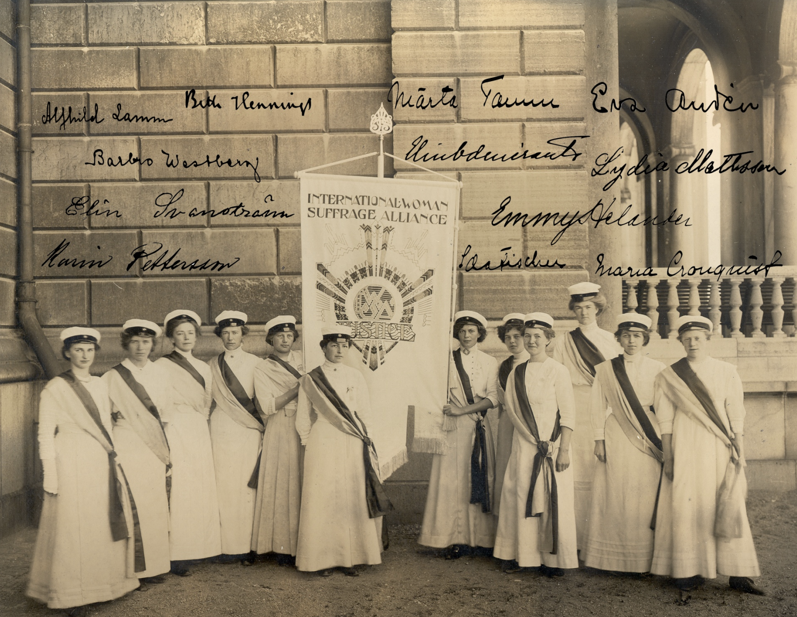

# Swedish Women's Suffrage Petitioners, 1913–14

This repository contains transcribed and harmonized data from the nationwide Swedish petition for women's political suffrage and eligibility for office in 1913–14. The petition was organized by the National Association for Women's Suffrage in Sweden (*Landsföreningen för kvinnans politiska rösträtt*) and submitted to the Swedish Parliament in 1914.

The source material was digitized through *I demokratins namn: kvinnorna som krävde rösträtt* on FromThePage, using scanned archival volumes from the National Archives of Sweden. The [source images and collaborative transcriptions are available here](https://fromthepage.com/riksarkivet/i-demokratins-namn).

Version 0.1 contains 18,733 petition lists and 350,092 petitioners after removing reviewed duplicate scans, blank source pages, and crossed-out or non-person entries.

Initial public release from the June 17, 2026 FromThePage export.

<p align="center">
  
</p>

<p align="center"><em>Swedish suffragists in 1911, with their 1913–14 petition signatures superimposed</em></p>

## Citation

If you use this data, please cite:

```bibtex
@dataset{bounadi_folkestad_2026_suffrage,
  title   = {Swedish Women's Suffrage Petitioners, 1913–14},
  author  = {Bounadi, Monir and Folkestad, Mattias},
  year    = {2026},
  version = {0.1}
}
```

## Data features

- Covers roughly 350,000 signatures, about 18 percent of women aged over 18 in Sweden at the time.
- Provides petition-list and petitioner-level files linked by `image_id`.
- Retains cleaned transcriptions alongside harmonized research variables.
- Includes harmonized counties, historical localities, and coordinates.
- Harmonizes contributions in Swedish kronor (SEK).
- Infers IPUMS-style marital status from titles.
- Classifies occupations using SwedPop HISCO codes inferred from transcribed titles and occupations.

## Data construction

The data were built from a June 17, 2026 export of completed FromThePage transcriptions, with later manual review of selected pages. The construction has four main steps:

1. Combine and clean the FromThePage CSV exports.
2. Preserve all transcribed fields after Unicode normalization and whitespace trimming.
3. Harmonize counties, localities, name counts, contributions, titles, occupations, marital status, and coordinates.
4. Classify occupations with the SwedPop HISCO coding scheme using both transcribed titles and occupations.

Transcribed titles and occupations were matched to a SwedPop code-list workbook supplied to the authors. The workbook is not redistributed here. The public SwedPop documentation used for coding is included unchanged in `documentation/hisco/`.

Key measurement notes:

- `entry_id` identifies a petitioner entry in this release. It is not a cross-list person identifier: a woman could sign more than one list, even though canvassers tried to remove duplicate signatures.
- `name_count` is a reviewed list-level count and need not equal the number of petitioner entries in `individuals.csv`.
- Coordinates refer to the locality heading on the petition list, not to individual street addresses.
- Blank contribution fields are coded as zero. Ambiguous, crossed-out, or non-currency contribution entries are left missing.
- HISCO code `99999` denotes an unclear occupation following SwedPop. Codes `-1` and `-2` denote no recorded current occupation and explicit absence of occupation, respectively.

## Getting started

Download the repository and use the two CSV files in `data/`:

| File | Unit of observation | Observations |
|---|---|---:|
| `data/lists.csv` | Petition list | 18,733 |
| `data/individuals.csv` | Petitioner | 350,092 |

The files merge many-to-one using `image_id`.

Important variables in `lists.csv` include:

- `image_id`: petition-list identifier and merge key.
- `source_url`: link to the source image and transcription.
- `county`, `place`: harmonized county and locality.
- `name_count`: harmonized list-level count of names.
- `total_contribution_sek`: harmonized list contribution in SEK.
- `place_latitude`, `place_longitude`: locality coordinates.

Important variables in `individuals.csv` include:

- `entry_id`: petitioner-entry identifier in this release.
- `first_name_transcribed`, `last_name_transcribed`: names as transcribed.
- `title_transcribed`, `occupation_transcribed`, `address_transcribed`: source fields as transcribed.
- `title_harmonized`, `occupation_harmonized`: harmonized title and occupation strings.
- `marital_status`: IPUMS-style marital-status code (`1` single/never married, `2` married/in union, `3` separated/divorced/spouse absent, `4` widowed, `9` unknown/missing).
- `contribution_sek`: harmonized individual contribution in SEK.
- `hisco_code`, `hisco_label`, `hisco_classification`: SwedPop HISCO assignment.

All files are UTF-8 encoded. Empty CSV cells represent missing values.

### Code examples

<details>
<summary>Python</summary>

```python
import pandas as pd

lists = pd.read_csv("data/lists.csv")
individuals = pd.read_csv("data/individuals.csv")

data = individuals.merge(lists, on="image_id", how="left", validate="many_to_one")
```

</details>

<details>
<summary>R</summary>

```r
lists <- read.csv("data/lists.csv", fileEncoding = "UTF-8")
individuals <- read.csv("data/individuals.csv", fileEncoding = "UTF-8")

data <- merge(individuals, lists, by = "image_id", all.x = TRUE, sort = FALSE)
```

</details>

<details>
<summary>Stata</summary>

```stata
import delimited "data/lists.csv", clear varnames(1) encoding("utf-8")
isid image_id
tempfile lists
save `lists'

import delimited "data/individuals.csv", clear varnames(1) encoding("utf-8")
isid entry_id
merge m:1 image_id using `lists', keep(master match) nogen
```

</details>

## License

The data are released under the [CC0 1.0 Universal](https://creativecommons.org/publicdomain/zero/1.0/) public-domain dedication. Scientific citation is appreciated.

The bundled SwedPop PDF is third-party documentation included unchanged for reproducibility. It remains attributable to SwedPop/CEDAR and its named author.

## Image credits

Image source: [Folkestad, Mattias. *Power and Politics: Essays in Applied Microeconomics*. Doctoral thesis, Stockholm University, 2026](https://urn.kb.se/resolve?urn=urn:nbn:se:su:diva-253369).

The reproduction is from Eva Andén's collection A 67:6, KvinnSam, Göteborgs universitetsbibliotek. It shows Stockholm during the Sixth Conference of the International Woman Suffrage Alliance, 12–17 June 1911. The superimposed signatures are from the 1913–14 mass petition and were written by women in the image: Märta Tamm, Lydia Mattsson, Beth Hennings, Elin Odencrantz, Karin Pettersson, Alfhild Lamm, Barbro Wästberg, Elin Svanström, Eva Andén, Emmy Helander, Ida Fischer, and Maja Cronquist.

## Version history

### Version 0.1

Initial public release from the June 17, 2026 FromThePage export.
